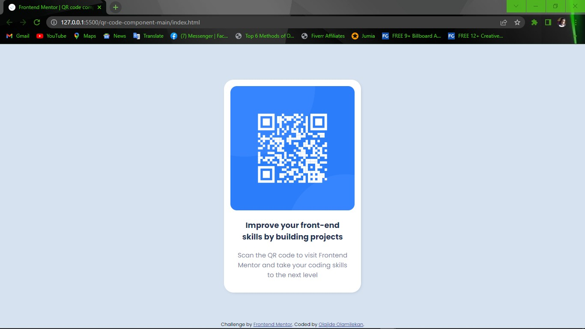

# Frontend Mentor - QR code component solution

This is a solution to the [QR code component challenge on Frontend Mentor](https://www.frontendmentor.io/challenges/qr-code-component-iux_sIO_H). Frontend Mentor challenges help you improve your coding skills by building realistic projects.

## Table of contents

- [Overview](#overview)
  - [Screenshot](#screenshot)
  - [Links](#links)
- [My process](#my-process)
  - [Built with](#built-with)
  - [What I learned](#what-i-learned)
  - [Continued development](#continued-development)
  - [Useful resources](#useful-resources)
- [Author](#author)
- [Acknowledgments](#acknowledgments)

## Overview

### Screenshot



### Links

- Live Site URL: [Netlify](https://app.netlify.com/olareposit)
- Github Repository URL: [Repository](https://github.com/olareposit/Frontend-Mentor/QR-CODE)

## My process

### Built with

- Semantic HTML5 markup
- CSS
- Flexbox

### What I learned

I learnt to center a div horizontally and vertically. After some trial and error, I visited [W3 Schools](https://www.w3schools.com) for some examples, which I got and was able to center my div.

Here's a snippet to center a _div_ using html and css below:

```html
<div class="container">
  <div class="content">...</div>
</div>
```

Here, I place the _div_ with a class of _content_ at the center of the _div_ with a class of _container_. To achieve that I wrapped the _content_ with container, as you can see above.

```css
.container {
  height: 100vh;
  display: flex;
  justify-content: center;
  align-items: center;
}
```

In my css file, I called the _.container_ referring to the _div_ with a class of _container_. See the analysis of these properties below;

#### _The Height Property_

I gave it a height of _100vh_ (Meaning: 100% Viewport Height), so as to place the child elements of the _div_ with a class of container at the center of the screen.

#### _The Display Property_

I assigned the _flex_ value to the _display_ property so as to be able to justify and align the content in the _div_ with a class of container, horizontally and vertically.

#### _The justify-content Property_

This property is assigned the value _center_ to make the _div_ horizontally centered.

#### _The align-items Property_

This property is assigned the value _center_ to make the _div_ vertically centered.

### Continued development

Positioning of objects is one area that i want to continue and improve myself on in the future.

Also, css animations is another continious development I aim.

### Useful resources

- [w3 Schools](https://www.w3schools.com) - This helped me with positioning. I really liked this pattern and will use it going forward.
- [MDN Web Docs](https://developer.mozilla.org) - This is an amazing article which helped me understand box-sizing. I'd recommend it to anyone still learning this concept.

## Author

- Frontend Mentor - [@olaReposit](https://www.frontendmentor.io/profile/olaReposit)\*\*
- Twitter - [@heis_olajide](https://www.twitter.com/heis_olajide)\*\*
- Netlify - [olaReposit](https://app.netlify.com/teams/olareposit/overview)\*\*
- Github - [olaReposit](https://github.com/olaReposit)\*\*

## Acknowledgments

I give all acknowledgments to Almighty God, the Beginning and the End.
